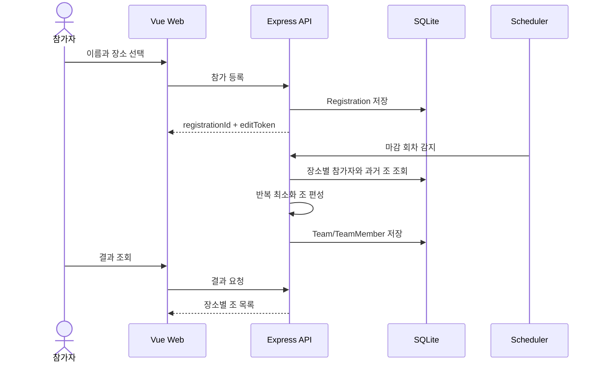
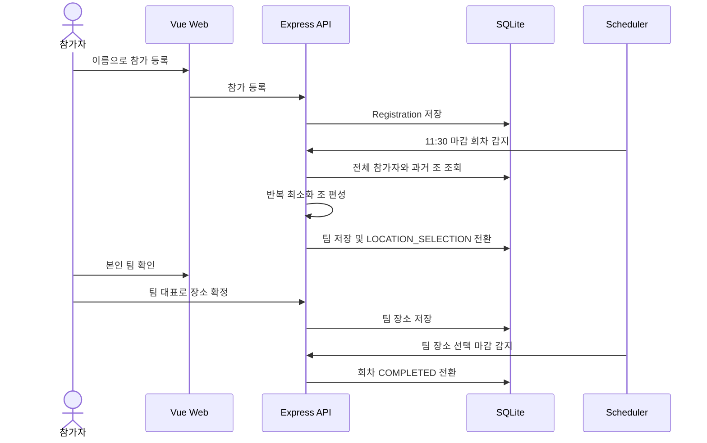
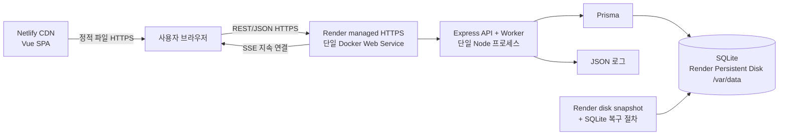
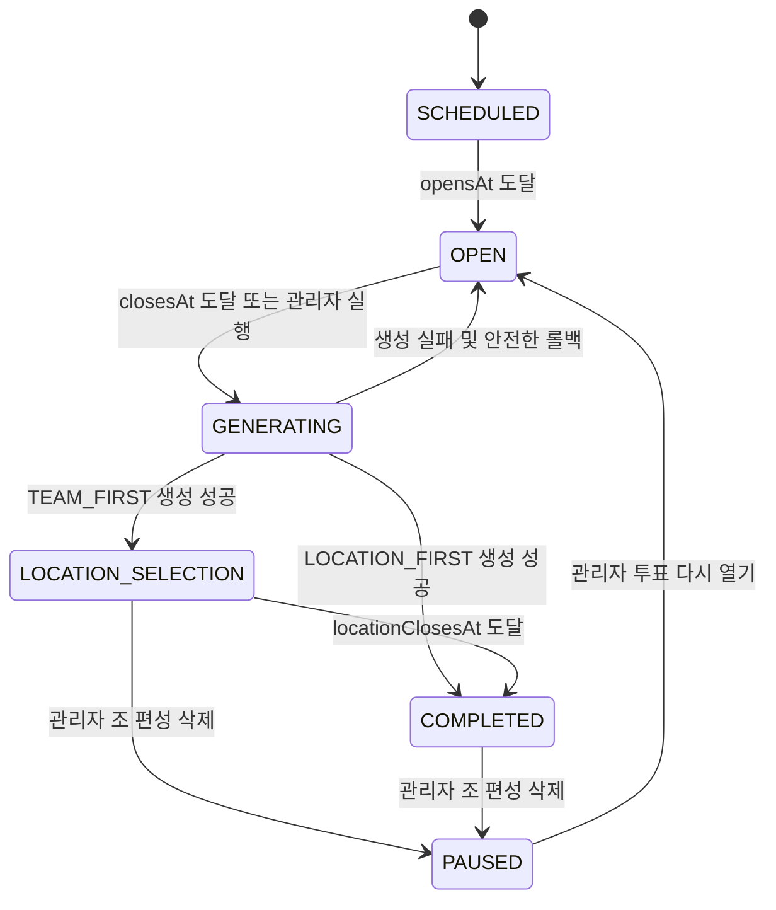
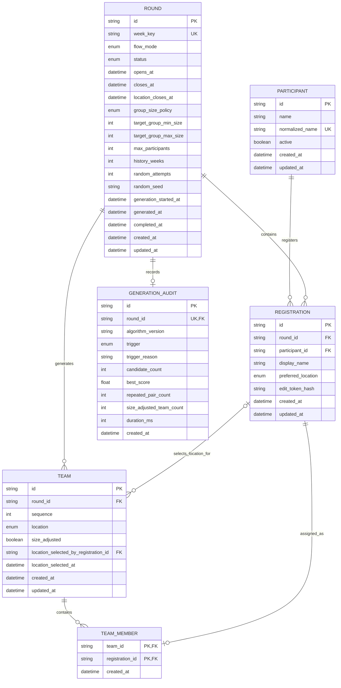

# 싸밥일레븐 시스템 설계서

## 1. 문서 정보

| 항목 | 내용 |
|---|---|
| 목적 | 최대 26명의 평일 일간 점심 투표와 목표 4~5명 단위의 적응형 랜덤 조 편성 서비스 설계 |
| 모노레포·패키지 관리 | pnpm 11 workspace |
| 프론트엔드 | Vue 3.5, Vue Router 4.6, Vite 7, TypeScript 5.9 |
| 백엔드 | Node.js 22, Express 5, TypeScript 5.9 |
| API 검증·보안 | Zod 4, Helmet 8, CORS 2, express-rate-limit 8 |
| 데이터베이스 | Prisma ORM 6.19, SQLite |
| 실시간 통신 | Server-Sent Events(SSE), Node.js EventEmitter 기반 인프로세스 pub/sub |
| 스케줄러 | Express 프로세스 내부 scheduler worker |
| 테스트·정적 검증 | Vitest 4, vue-tsc 3, TypeScript compiler |
| 컨테이너 | Docker, Node.js 22 Alpine image |
| 배포·영속화 | Netlify(Vue SPA), Render 단일 Docker Web Service, Render Persistent Disk |
| 기준 시간대 | Asia/Seoul |
| 서비스 범위 | 대한민국 단일 지역, 한국어 UI, 회차당 최대 26명 |
| API 규격 | `docs/openapi.yaml` |
| 고정 설계 결정 | 용량·편성: `docs/adr/0001-small-single-region-adaptive-groups.md`, 배포: `docs/adr/0002-netlify-render-single-instance.md` |

## 2. 목표와 범위

### 2.1 목표

1. 참가자는 이름을 입력해 한 회차에 한 번 참여한다.
2. `10층`, `20층`, `밖` 중 하나를 선택하는 장소 우선 흐름을 지원한다.
3. 월요일부터 금요일까지 매일 08시 30분에 투표를 열고 11시 30분에 닫아 자동으로 조를 생성한다.
4. 조는 4~5명을 목표로 구성하되 인원이 맞지 않으면 누락 없이 균등하게 조 크기를 조정한다.
5. 최근에 같은 조였던 사람의 재매칭을 가능한 한 줄인다.
6. 환경변수로 `장소 선택 → 조 편성`과 `조 편성 → 장소 선택`을 전환한다.

### 2.2 MVP 범위

- 이름 기반 참가 등록, 수정, 취소
- 평일 일간 회차 자동 생성 및 자동 마감
- 장소 우선/팀 우선 운영 모드
- 과거 편성 이력을 반영한 조 생성
- 결과 조회
- 최소 관리자 기능
- Render 단일 Web Service 운영과 Persistent Disk의 SQLite 백업·복구 검증
- 회차당 최대 26명과 대한민국 단일 지역 운영

### 2.3 MVP 제외 범위

- 사내 SSO, 소셜 로그인
- 이메일, Slack 등 외부 알림
- 양방향 WebSocket 통신(단방향 상태 전파는 SSE로 제공)
- 복수 Render 인스턴스와 자동 확장
- 다중 리전, 지역별 라우팅, 다국어 지원
- 조 생성 후 일반 관리자의 임의 재추첨
- 식당 메뉴 또는 예약 시스템 연동

## 3. 확정한 운영 정책

명시되지 않은 부분은 MVP 구현을 위해 다음과 같이 정의한다.

| 항목 | 정책 |
|---|---|
| 사용자 식별 | Unicode 정규화와 앞뒤 공백 제거 후 공백 없는 정확히 3글자 이름 |
| 동명이인 | 서로 구분되는 공백 없는 3글자 별칭으로 등록 |
| 중복 등록 | 한 회차에 동일 참가자는 한 번만 등록 가능 |
| 등록 수정 | 최초 등록 때 발급한 편집 토큰 필요 |
| 편집 토큰 분실 | 사용자가 직접 복구할 수 없으며 관리자가 등록을 수정/삭제 |
| 결과 공개 | 조 생성 완료 후 이름과 조/장소를 전체 공개 |
| 장소 우선 | 선택한 장소 안에서만 조 편성 |
| 팀 우선 | 전체 참가자를 편성한 후 팀원 한 명이 대표로 장소 확정 |
| 팀 장소 충돌 | 최초 확정자가 소유하며 같은 사람만 마감 전 수정/취소 가능 |
| 조 크기 | 4~5명은 목표값이며, 인원이 맞지 않으면 전체 참가자를 누락하지 않는 범위에서 균등 조정 |
| 최대 인원 | 회차당 26명. 초과 등록은 받지 않고 관리자에게 안내 |
| 운영 일정 | 한국 시간 기준 월~금 08:30 투표 시작, 당일 11:30 마감 및 자동 조 편성 |
| 서비스 지역 | 대한민국만 지원하며 `Asia/Seoul`, `ko-KR`을 고정 사용 |
| 과거 중복 | 금지 조건이 아닌 최적화 점수로 적용 |
| 재추첨 | MVP 일반 기능으로 제공하지 않음 |

이름만으로는 본인 인증이나 사칭 방지가 불가능하다. 사내 신뢰 환경을 전제로 하며, 보안 수준을 높일 때는 `participant.employee_code` 또는 SSO 식별자를 추가한다.

최대 26명과 적응형 조 크기 정책은 [ADR-0001](adr/0001-small-single-region-adaptive-groups.md), Netlify·Render 단일 인스턴스 배포는 [ADR-0002](adr/0002-netlify-render-single-instance.md)의 승인된 결정이다. 구현 중 대규모 분산 구조나 4~5명 하드 제한으로 되돌리지 않는다. 요구사항이 바뀌면 기존 문서를 조용히 수정하지 않고 새 ADR로 변경 결정을 명시적으로 대체한다.

## 4. 운영 모드

### 4.1 LOCATION_FIRST



1. 등록 요청에 `preferredLocation`이 필수다.
2. 마감 시 참가자를 장소별 버킷으로 나눈다.
3. 각 버킷을 독립적으로 편성한다.
4. 조의 장소는 버킷의 장소로 자동 확정된다.
5. 조 생성 트랜잭션이 끝나면 회차 상태는 `COMPLETED`가 된다.

### 4.2 TEAM_FIRST



1. 등록 요청의 `preferredLocation`은 금지한다.
2. 11시 30분에 전체 참가자를 대상으로 조를 생성한다.
3. 회차 상태를 `LOCATION_SELECTION`으로 바꾼다.
4. 팀원은 자신의 편집 토큰으로 소속을 증명하고 팀 장소를 확정한다.
5. 최초 장소 확정자만 마감 전 변경하거나 취소할 수 있다.
6. 장소 선택 마감 시 선택하지 않은 조는 `location=null`인 상태로 완료한다.

## 5. 시스템 아키텍처



### 5.1 컴포넌트 책임

| 컴포넌트 | 책임 |
|---|---|
| Vue SPA | 현재 회차 표시, 등록/수정/취소, 결과, 관리자 UI, SSE 이벤트 반영 |
| Express API | 검증, 권한 확인, 비즈니스 로직, REST API, 인프로세스 pub/sub와 SSE 전파 |
| Worker | 회차 생성, 투표 마감, 조 생성, 팀 장소 선택 마감 |
| Prisma | 데이터 접근과 마이그레이션 |
| SQLite | Render Persistent Disk의 `/var/data/lunch.db`에 참가자, 회차, 등록, 팀, 감사 데이터 영속화 |
| Netlify | Vue 정적 파일 빌드·배포, CDN, TLS, SPA routing rewrite |
| Render | Docker Web Service 실행, TLS 종료, health check, Persistent Disk 연결 |

### 5.2 코드 구조

```text
/
├─ apps/
│  ├─ web/
│  │  └─ src/
│  │     ├─ api/
│  │     ├─ components/
│  │     ├─ composables/
│  │     ├─ pages/
│  │     ├─ router/
│  │     └─ types/
│  └─ api/
│     ├─ prisma/
│     │  ├─ schema.prisma
│     │  └─ migrations/
│     └─ src/
│        ├─ config/
│        ├─ controllers/
│        ├─ middleware/
│        ├─ repositories/
│        ├─ routes/
│        ├─ schemas/
│        ├─ services/
│        │  ├─ round-service.ts
│        │  ├─ registration-service.ts
│        │  ├─ team-generator.ts
│        │  └─ scheduler-service.ts
│        ├─ worker/
│        ├─ app.ts
│        └─ server.ts
├─ packages/
│  └─ shared/
├─ docs/
│  ├─ system-design.md
│  └─ openapi.yaml
├─ docker-compose.yml
└─ pnpm-workspace.yaml
```

컨트롤러는 HTTP 변환만 담당하고, 조 편성 및 상태 변경은 서비스 계층에 둔다. Prisma 호출은 repository 계층으로 제한해 알고리즘 테스트가 DB에 의존하지 않게 한다.

## 6. 도메인 상태 모델

### 6.1 회차 상태



| 상태 | 등록 | 결과 | 팀 장소 선택 |
|---|---:|---:|---:|
| `SCHEDULED` | 불가 | 불가 | 불가 |
| `OPEN` | 가능 | 불가 | 불가 |
| `GENERATING` | 불가 | 준비 중 | 불가 |
| `PAUSED` | 불가 | 불가 | 불가 |
| `LOCATION_SELECTION` | 불가 | 가능 | 가능 |
| `COMPLETED` | 불가 | 가능 | 불가 |

### 6.2 상태 변경 원칙

- 상태 검증은 클라이언트가 아닌 API가 수행한다.
- 모든 시간은 DB에 UTC로 저장하고, 회차 계산만 `Asia/Seoul` 기준으로 수행한다.
- 회차 생성 시 현재 환경설정을 회차 컬럼에 스냅샷으로 저장한다.
- 조 생성 중 실패하면 팀 데이터가 부분 저장되지 않도록 트랜잭션을 사용한다.
- 일정 시간 이상 `GENERATING`인 회차는 worker가 복구 대상으로 판단한다.

## 7. ERD



### 7.1 제약 조건과 인덱스

| 테이블 | 제약/인덱스 |
|---|---|
| `participant` | `normalized_name` UNIQUE |
| `round` | `week_key` UNIQUE, `(status, closes_at)` INDEX |
| `registration` | `(round_id, participant_id)` UNIQUE, `round_id` INDEX |
| `team` | `(round_id, sequence)` UNIQUE, `round_id` INDEX |
| `team_member` | `(team_id, registration_id)` PK, `registration_id` UNIQUE |
| `generation_audit` | `round_id` UNIQUE |

`team_member.registration_id`를 UNIQUE로 두어 한 등록이 둘 이상의 조에 들어가지 못하게 한다. 팀과 등록의 회차가 같은지는 DB FK만으로 보장하기 어려우므로 서비스와 통합 테스트에서 검사한다.

`participant.name`은 다음 회차에서 동일인을 찾기 위한 현재 이름이고, `registration.display_name`은 해당 회차 결과에 표시할 이름 스냅샷이다. 이름 수정 시 현재 참가자와 현재 회차 스냅샷을 함께 갱신하지만, 완료된 과거 회차의 표시 이름은 바꾸지 않는다. API의 `registration.participant.name`에는 이 스냅샷 값을 매핑한다.

## 8. 조 편성 알고리즘

### 8.1 요구 특성

- 모든 유효 등록은 정확히 한 조에 포함한다.
- `LOCATION_FIRST`에서는 서로 다른 장소가 섞이지 않는다.
- 기본 목표는 모든 조를 4~5명으로 만드는 것이다.
- 목표 크기로 정확히 나눌 수 없으면 전체 참가자를 누락하지 않고 가장 적은 편차로 균등 조정한다.
- 조 크기 조정은 정상 동작이며 생성 실패나 수동 개입 사유가 아니다.
- 최근 같은 조였던 두 사람이 다시 같은 조가 되는 점수를 최소화한다.
- 동일 seed와 동일 입력이면 동일한 결과를 만든다.

### 8.2 조 크기 계산

인원 `n`, 목표 최소 `targetMin=4`, 목표 최대 `targetMax=5`일 때 `ADAPTIVE` 정책으로 다음을 계산한다.

1. `n=0`이면 조를 만들지 않는다.
2. `ceil(n / targetMax) <= k <= floor(n / targetMin)`인 조 개수 `k`를 찾는다.
3. 가능한 `k`가 있으면 모든 조가 목표 범위에 들도록 가장 균등하게 나눈다.
4. 가능한 `k`가 없으면 모든 현실적인 조 개수를 비교한다.
5. 목표 범위 이탈 거리 합계, 조정된 조 수, 최대 편차 순으로 가장 작은 후보를 고른다.
6. 그래도 동점이면 조 수가 적은 후보를 고르고, 같은 크기의 조들 사이에 참가자를 랜덤 배치한다.

기본 예외 예시는 다음과 같다.

| 인원 | 결과 |
|---:|---|
| 0 | 조 없음 |
| 1~3 | 해당 인원으로 조 1개(자동 조정) |
| 4 | 4 |
| 5 | 5 |
| 6 | 6(자동 조정) |
| 7 | 4+3(자동 조정) |
| 8 | 4+4 |
| 9 | 5+4 |
| 10 | 5+5 |
| 11 | 6+5(자동 조정) |
| 12 | 4+4+4 |
| 26 | 5+5+4+4+4+4 |

장소 우선 모드는 장소별 인원이 작아 1~3명 또는 6명 조가 생길 수 있다. 이는 허용된 정상 결과이며, 장소 선택을 존중하기 위해 다른 장소와 합치지 않는다. 결과 화면에는 `sizeAdjusted=true`인 조에 “참가 인원에 맞춰 조 크기가 조정되었습니다”라고 안내한다.

### 8.3 과거 중복 점수

최근 `historyWeeks` 안에 같은 팀이었던 모든 참가자 쌍을 조회해 pair penalty map을 만든다.

```text
pairPenalty(A, B) = Σ (10 + recencyBonus)
recencyBonus = max(0, historyWeeks - weeksAgo) × 2

candidateScore =
  Σ 새 팀 내부 모든 참가자 쌍의 pairPenalty
  + targetSizeDeviationPenalty
```

- 최근 만남일수록 패널티가 크다.
- 같은 사람과 여러 번 만났다면 패널티가 누적된다.
- 중복을 완전히 금지하지 않으므로 인원이 적어도 항상 결과를 낼 수 있다.
- `targetSizeDeviationPenalty`는 중복 회피만을 위해 목표 크기를 깨지 않도록 충분히 큰 값으로 둔다. 다만 목표 크기로 나눌 수 없는 경우에는 조정 결과를 정상적으로 허용한다.

### 8.4 후보 탐색

```text
generateTeams(registrations, history, settings, seed):
  buckets = splitByLocationIfRequired(registrations)
  result = []

  for bucket in buckets:
    sizes = calculateAdaptiveTeamSizes(bucket.count, targetMin, targetMax)
    best = null

    repeat randomAttempts times:
      candidate = seededShuffleAndPartition(bucket, sizes)
      candidate = improveByPairSwaps(candidate, history)
      score = calculateScore(candidate, history, sizes)

      if best is null or score < best.score:
        best = candidate

    result += best

  return result
```

최대 인원이 26명으로 고정되어 있으므로 기본 `randomAttempts=500`이면 충분하다. 대규모 최적화나 분산 계산은 구현하지 않고, 단일 프로세스의 랜덤 재시작과 pair swap 방식만 사용한다.

### 8.5 원자성과 재현성

1. 회차를 조건부 갱신해 `OPEN → GENERATING`을 선점한다.
2. `randomSeed`가 없으면 암호학적 난수로 생성해 저장한다.
3. 후보를 메모리에서 계산한다.
4. 하나의 DB 트랜잭션으로 팀, 팀원, 감사 정보를 저장한다.
5. 모드에 따라 `COMPLETED` 또는 `LOCATION_SELECTION`으로 변경한다.
6. 저장 트랜잭션이 실패하면 팀 데이터는 전부 롤백한다.
7. worker 재시작 시 오래된 `GENERATING` 회차는 같은 seed로 재시도한다.

## 9. API 설계

상세 스키마와 예시는 `docs/openapi.yaml`을 기준으로 한다.

### 9.1 공통 규칙

- Base URL: `/api/v1`
- Content-Type: `application/json`
- 날짜: ISO 8601 UTC 문자열
- ID: UUID
- 장소 enum: `FLOOR_10`, `FLOOR_20`, `OUTSIDE`
- 운영 모드 enum: `LOCATION_FIRST`, `TEAM_FIRST`
- 편집 인증: `X-Edit-Token`
- 관리자 인증: `Authorization: Bearer <ADMIN_TOKEN>`
- 추적 ID: 응답 `X-Request-Id`

### 9.2 공개 API 목록

| Method | Path | 설명 |
|---|---|---|
| GET | `/health/live` | 프로세스 생존 확인 |
| GET | `/health/ready` | DB 포함 준비 상태 확인 |
| GET | `/rounds/current` | 현재 회차와 화면 규칙 조회 |
| GET | `/events?roundId={roundId}` | 회차 변경 이벤트 SSE 구독 |
| POST | `/rounds/{roundId}/registrations` | 참가 등록 및 편집 토큰 발급 |
| GET | `/registrations/{registrationId}` | 편집 토큰으로 내 등록/팀 조회 |
| PATCH | `/registrations/{registrationId}` | 마감 전 내 등록 수정 |
| DELETE | `/registrations/{registrationId}` | 마감 전 내 등록 취소 |
| GET | `/rounds/{roundId}/results` | 회차 상태와 생성된 조 조회 |
| PATCH | `/teams/{teamId}/location` | 팀 대표 장소 확정/수정 |
| DELETE | `/teams/{teamId}/location` | 팀 대표 장소 선택 취소 |

### 9.3 관리자 API 목록

| Method | Path | 설명 |
|---|---|---|
| GET | `/admin/rounds` | 회차 목록 조회 |
| POST | `/admin/rounds` | 테스트/예외용 회차 수동 생성 |
| GET | `/admin/rounds/{roundId}` | 참가 현황 포함 회차 상세 조회 |
| POST | `/admin/rounds/{roundId}/open` | 예약 회차의 투표를 운영 환경에서도 즉시 열기 |
| DELETE | `/admin/rounds/{roundId}/teams` | 기존 조 편성 삭제 후 `PAUSED` 전환, 참가자 유지 |
| POST | `/admin/rounds/{roundId}/reopen` | `PAUSED` 회차의 투표를 30분간 다시 열기 |
| POST | `/admin/rounds/{roundId}/generate` | 회차 강제 마감 및 조 생성 |
| PATCH | `/admin/registrations/{registrationId}` | 참가자 이름/장소 정정 |
| DELETE | `/admin/registrations/{registrationId}` | 등록 삭제 |
| PUT | `/admin/teams/{teamId}/location` | 팀 장소 강제 지정/정정 |

개발 환경(`NODE_ENV=development`) 전용 API:

| Method | Path | 설명 |
|---|---|---|
| POST | `/dev/rounds/{roundId}/actions` | 투표 열기, 샘플 인원 추가, 즉시 편성, 강제 완료, 전체 초기화 |

`open`, `teams`, `reopen`, `generate` 관리자 API는 배포 환경에서도 기존 관리자 Bearer 토큰 인증 후 사용할 수 있다. `open`은 `SCHEDULED` 회차만 `OPEN`으로 전환하고 `opensAt`만 현재 시각으로 변경하며 기존 자동 마감 시각은 유지한다. `teams` 삭제는 `LOCATION_SELECTION` 또는 `COMPLETED` 회차의 팀·팀원·생성 감사 기록을 트랜잭션으로 삭제하고 seed와 생성 시각을 초기화한 뒤 `PAUSED`로 전환한다. 이 단계에서는 기존 참가자 등록을 유지하며 투표를 열지 않는다. `reopen`은 `PAUSED` 회차만 현재 시각부터 30분간 `OPEN`으로 전환한다. `TEAM_FIRST`의 장소 선택 마감은 재개 시각부터 40분 후로 다시 잡는다. 개발 API도 같은 관리자 토큰이 필요하지만, 샘플 인원·강제 완료·전체 초기화 같은 테스트 기능을 포함하므로 운영 환경에서는 경로 자체를 `404`로 숨긴다.

관리자 등록 수정/삭제는 팀 생성 전까지만 가능하고, 팀 장소 지정은 `LOCATION_SELECTION`에서만 가능하다. 완료된 회차의 조 구성과 표시 이름은 감사 가능성을 위해 변경하지 않는다.

### 9.4 등록 예시

```http
POST /api/v1/rounds/7f9.../registrations
Content-Type: application/json

{
  "name": "홍길동",
  "preferredLocation": "FLOOR_10"
}
```

```json
{
  "data": {
    "registration": {
      "id": "5a2...",
      "roundId": "7f9...",
      "participant": {
        "id": "2b1...",
        "name": "홍길동"
      },
      "preferredLocation": "FLOOR_10",
      "createdAt": "2026-07-17T00:10:00.000Z",
      "updatedAt": "2026-07-17T00:10:00.000Z"
    },
    "editToken": "url-safe-random-token"
  }
}
```

`editToken`은 이 응답에서만 평문으로 반환하고 서버에는 HMAC 또는 SHA-256 기반 해시만 저장한다. 프론트엔드는 `registrationId`와 토큰을 localStorage에 보관하되 로그나 분석 도구로 전송하지 않는다.

### 9.5 오류 형식

```json
{
  "error": {
    "code": "ROUND_NOT_OPEN",
    "message": "현재 회차의 참가 등록이 마감되었습니다.",
    "details": null,
    "requestId": "01J..."
  }
}
```

주요 오류 코드는 다음과 같다.

| HTTP | 코드 | 상황 |
|---:|---|---|
| 400 | `VALIDATION_ERROR` | 요청 형식 오류 |
| 401 | `INVALID_EDIT_TOKEN` | 편집 토큰 누락/불일치 |
| 401 | `INVALID_ADMIN_TOKEN` | 관리자 토큰 불일치 |
| 404 | `ROUND_NOT_FOUND` | 회차 없음 |
| 404 | `REGISTRATION_NOT_FOUND` | 등록 없음 |
| 404 | `TEAM_NOT_FOUND` | 팀 없음 |
| 409 | `ROUND_NOT_OPEN` | 등록 가능 상태가 아님 |
| 409 | `REGISTRATION_ALREADY_EXISTS` | 같은 참가자의 회차 중복 등록 |
| 409 | `LOCATION_REQUIRED` | 장소 우선 모드에서 장소 누락 |
| 409 | `LOCATION_NOT_ALLOWED` | 팀 우선 등록에 장소 포함 |
| 409 | `RESULT_NOT_READY` | 조 생성 전 결과 요구 |
| 409 | `TEAM_LOCATION_ALREADY_SELECTED` | 다른 팀원이 이미 장소 확정 |
| 429 | `RATE_LIMITED` | 요청 제한 초과 |
| 500 | `INTERNAL_ERROR` | 예상하지 못한 서버 오류 |

## 10. 프론트엔드 설계

### 10.1 라우트

| Route | 화면 |
|---|---|
| `/` | 현재 회차, 등록 폼, 내 등록 수정/취소 |
| `/results` | 현재 회차 조 편성 결과 |
| `/history/:weekKey` | 과거 회차 결과(선택 구현) |
| `/admin` | 관리자 회차/참가/팀 관리 |

### 10.2 메인 화면 상태

| 회차 상태 | UI |
|---|---|
| `SCHEDULED` | 투표 시작 시간 안내 |
| `OPEN` | 이름/장소 폼 또는 내 등록 카드, 마감 카운트다운 |
| `GENERATING` | 조 편성 중 안내, 서버의 결과 변경 이벤트 대기 |
| `PAUSED` | 조 편성 삭제 및 관리자 재투표 대기 안내 |
| `LOCATION_SELECTION` | 조 결과와 팀 장소 선택 UI |
| `COMPLETED` | 최종 결과 |

### 10.3 클라이언트 저장

```text
localStorage key: lunch-registration:{roundId}
value: {
  registrationId,
  editToken,
  participantName
}
```

- 토큰은 Pinia 전역 영속화 플러그인보다 작은 전용 저장 모듈로 관리한다.
- API 응답의 `serverTime`을 기준으로 카운트다운 오차를 보정한다.
- 화면 진입 시 회차별 `EventSource` 연결을 하나 열고 서버가 참가 인원, 회차 상태, 편성 결과, 팀 장소 변경 이벤트를 전송한다.
- 참가 인원은 `registration.count.changed` payload를 즉시 반영하고, 상태/결과 이벤트 때만 해당 REST 리소스를 다시 조회한다. 주기적 HTTP polling은 사용하지 않는다.
- 브라우저의 SSE 자동 재연결을 사용하며 서버는 연결 유지를 위한 comment heartbeat만 전송한다.
- 프론트의 운영 모드는 `/rounds/current` 응답을 신뢰한다.

### 10.4 실시간 pub/sub 경계

- Express 프로세스 내부 `EventEmitter`를 회차별 pub/sub 버스로 사용한다.
- 등록 생성/삭제, 관리자 등록 변경, 회차 상태 전환, 조 생성, 팀 장소 변경이 커밋된 뒤 이벤트를 발행한다.
- SSE는 서버→브라우저 단방향 알림이므로 참가 등록과 관리자 명령은 기존 REST API를 사용한다.
- 단일 Render Web Service·단일 Node 프로세스라는 승인된 운영 구조에서만 이벤트 전달을 보장한다. 복수 프로세스가 필요해지면 외부 pub/sub 도입을 새 ADR로 결정한다.

## 11. 스케줄러 설계

### 11.1 단일 Render Web Service 방식

Express 프로세스 내부 worker가 `SCHEDULER_POLL_INTERVAL_MS`마다 다음 작업을 수행한다.

1. 오늘이 활성 평일이면 오늘 회차를, 주말이면 다음 월요일 회차를 환경변수 스냅샷과 함께 생성한다.
2. `opensAt <= now`인 `SCHEDULED` 회차를 `OPEN`으로 변경한다.
3. `closesAt <= now`인 `OPEN` 회차의 조 생성을 선점한다.
4. 오래된 `GENERATING` 회차를 같은 seed로 복구한다.
5. `locationClosesAt <= now`인 `LOCATION_SELECTION` 회차를 완료한다.

프로세스가 정확히 11시 30분에 중단되어도 재기동 후 overdue 회차를 찾아 처리한다. SQLite를 쓰는 동안 Node cluster 모드나 복수 API 컨테이너를 사용하지 않는다.

### 11.2 용량 및 지역 경계

- 회차당 최대 26명만 지원한다.
- 대한민국 사용자만 대상으로 하며 시간대는 `Asia/Seoul`, 화면 언어는 `ko-KR`로 고정한다.
- 호스팅은 Render에서 선택 가능한 단일 리전을 사용하며 특정 AWS 서울 리전은 요구하지 않는다.
- 다중 리전, 자동 확장, 메시지 큐, 분산 worker, PostgreSQL 전환은 현재 범위가 아니다.
- 26명 초과나 고가용성 요구가 새로 생길 때에만 별도 ADR을 작성해 구조 변경을 검토한다.

## 12. 환경변수

```env
NODE_ENV=production
# PORT는 Render가 주입
APP_TIMEZONE=Asia/Seoul
APP_LOCALE=ko-KR
MAX_PARTICIPANTS_PER_ROUND=26

FLOW_MODE=LOCATION_FIRST
VOTE_WEEKDAYS=MON,TUE,WED,THU,FRI
VOTE_OPEN_TIME=08:30
VOTE_CLOSE_TIME=11:30
TEAM_LOCATION_CLOSE_TIME=11:40

GROUP_SIZE_POLICY=ADAPTIVE
TARGET_GROUP_MIN_SIZE=4
TARGET_GROUP_MAX_SIZE=5
HISTORY_WEEKS=8
RANDOM_ATTEMPTS=500
GENERATION_STALE_MINUTES=5
SCHEDULER_POLL_INTERVAL_MS=30000
SSE_HEARTBEAT_INTERVAL_MS=20000

DATABASE_URL=file:/var/data/lunch.db
WEB_ORIGIN=https://<netlify-site>.netlify.app
ADMIN_TOKEN=replace-with-long-random-token
EDIT_TOKEN_PEPPER=replace-with-long-random-secret
LOG_LEVEL=info

# Netlify build environment
VITE_API_BASE_URL=https://<render-service>.onrender.com/api/v1
```

검증 규칙:

- 운영 모드와 쉼표로 구분한 요일/시간 값을 시작 시 Zod로 검증한다.
- 배포 운영 일정은 월요일부터 금요일까지 매일 08:30 투표 시작, 11:30 투표 마감과 자동 조 편성으로 설정한다.
- `VOTE_OPEN_TIME < VOTE_CLOSE_TIME`이어야 한다.
- `MAX_PARTICIPANTS_PER_ROUND=26`을 기본이자 운영 상한으로 사용한다.
- `TARGET_GROUP_MIN_SIZE <= TARGET_GROUP_MAX_SIZE`여야 한다.
- `SSE_HEARTBEAT_INTERVAL_MS`는 5,000~60,000ms 범위여야 한다.
- 목표값 4~5는 환경변수로 조정할 수 있지만 `GROUP_SIZE_POLICY=ADAPTIVE`는 유지한다.
- `TEAM_FIRST`의 장소 선택 마감은 투표 마감보다 늦어야 한다.
- secret이 기본값이거나 너무 짧으면 production 시작을 거부한다.
- 환경변수 변경은 새로 생성하는 회차부터 적용한다.
- 기존 API와 DB 호환성을 위해 회차 식별 필드명은 `weekKey`를 유지한다. 신규 자동 회차 값은 한국 날짜 `YYYY-MM-DD`이며 기존 `YYYY-Www` 데이터도 조회할 수 있다.
- Render가 주입한 `PORT`를 사용하고 서버는 `0.0.0.0`에서 요청을 받아야 한다.
- `DATABASE_URL`은 `/var/data`에 마운트한 Render Persistent Disk 아래를 가리켜야 한다.
- Netlify의 `VITE_API_BASE_URL`은 빌드 시 주입되므로 값 변경 후 새 배포가 필요하다.

## 13. 보안 설계

- `helmet`으로 기본 보안 헤더 설정
- `cors`는 정확한 Netlify 운영 origin allowlist를 사용하고, 필요한 Preview origin만 명시적으로 추가
- 등록 API는 IP 기준, 편집 API는 IP+토큰 기준 rate limit
- 이름은 Unicode 정규화(NFKC)와 trim 후 내부 공백 없이 정확히 3글자로 제한
- HTML은 Vue 기본 escaping을 사용하고 `v-html` 사용 금지
- 편집 토큰과 관리자 토큰을 로그에 남기지 않음
- 편집 토큰은 최소 256-bit 랜덤 값, DB에는 해시만 저장
- 관리자 토큰 비교는 timing-safe compare 사용
- API는 Render가 제공하는 HTTPS endpoint만 공개하고 TLS는 Render에서 종료
- Render 프록시 뒤의 실제 클라이언트 IP를 사용하도록 Express `trust proxy`를 설정한 뒤 rate limit 동작 검증
- 요청 본문 크기를 작은 값(예: 16KB)으로 제한
- Prisma raw query는 필요한 경우에도 매개변수 바인딩 사용
- 에러 응답에 stack trace, SQL, 환경변수를 포함하지 않음

이 설계의 편집 토큰은 등록 수정권만 보호하며 실제 신원 인증이 아니다. 사내망 밖에서 공개 운영할 경우 SSO 도입을 우선한다.

## 14. 배포 설계

### 14.1 Netlify 프론트엔드

| 설정 | 값 |
|---|---|
| Base Directory | 저장소 루트 |
| Build Command | `pnpm --filter @ssabap/shared build && pnpm --filter @ssabap/web build` |
| Publish Directory | `apps/web/dist` |
| 환경변수 | `NODE_VERSION=22`, `VITE_API_BASE_URL=https://<render-service>.onrender.com/api/v1` |

- pnpm workspace의 `packages/shared`를 먼저 빌드해야 하므로 `apps/web`만 독립 프로젝트처럼 빌드하지 않는다.
- Vue Router history mode를 위해 `/*` 요청을 `/index.html`로 보내는 status `200` rewrite를 적용한다.
- main 브랜치를 production에 연결하고 필요할 때만 Deploy Preview를 사용한다.
- Preview에서도 API를 호출해야 한다면 해당 Preview origin을 Render의 `WEB_ORIGIN` allowlist에 명시적으로 추가한다.
- Netlify build는 저장소의 `.env`를 자동으로 읽는 전제로 운영하지 않는다. `VITE_API_BASE_URL`은 Netlify UI/CLI의 build 환경변수로 등록하고 변경 후 재배포한다.

### 14.2 Render 백엔드

| 설정 | 값 |
|---|---|
| Service Type | Web Service |
| Runtime | Docker |
| Docker Build Context | 저장소 루트 |
| Dockerfile Path | `apps/api/Dockerfile` |
| Health Check Path | `/api/v1/health/ready` |
| Instance Count | 1 |
| Persistent Disk Mount Path | `/var/data` |
| Database URL | `file:/var/data/lunch.db` |

- Render가 주입하는 `PORT`를 사용하고 `0.0.0.0`에 바인딩한다.
- Render가 TLS와 public HTTPS endpoint를 관리하므로 Caddy/Nginx와 `docker-compose.yml`은 운영 경로에 포함하지 않는다.
- `packages/shared`가 Docker build에 필요하므로 Build Context를 `apps/api`로 좁히지 않는다.
- Render pre-deploy command는 Persistent Disk에 접근할 수 없다. 기존 Docker 시작 명령에서 `prisma migrate deploy`를 실행한 뒤 API를 시작한다.
- `WEB_ORIGIN=https://<netlify-site>.netlify.app`를 설정하고 `ADMIN_TOKEN`, `EDIT_TOKEN_PEPPER`는 서로 다른 긴 임의 secret으로 등록한다.
- SQLite와 인프로세스 pub/sub를 사용하므로 autoscaling과 복수 인스턴스를 활성화하지 않는다.
- Render 기본 파일시스템은 임시 저장소이므로 운영 데이터는 반드시 `/var/data` 아래에 저장한다. Persistent Disk를 제공하지 않는 무료 Web Service는 운영 SQLite 용도로 사용할 수 없다.

### 14.3 데이터 보호와 복구

- Render Persistent Disk의 암호화와 일일 snapshot을 기본 보호 수단으로 사용한다.
- snapshot만 믿지 않고 조 생성 직후 또는 최소 일 1회 SQLite 일관성 백업을 별도 저장소로 내보내는 절차를 마련한다.
- 복구 시점에 DB 파일과 애플리케이션 스키마 버전이 맞는지 확인한다.
- 배포 전 테스트 환경에서 Persistent Disk 재연결, 재배포 후 데이터 유지, snapshot 또는 SQLite 백업 복구를 검증한다.
- 백업 보관 기간과 삭제 정책은 실제 Render 요금제 및 조직 정책을 확인한 뒤 운영 체크리스트에 확정한다.

### 14.4 현재 저장소 반영 상태

| 항목 | 상태 | 배포 전 조치 |
|---|---|---|
| Render Docker build | 기존 `apps/api/Dockerfile` 사용 가능 | Render의 Build Context를 저장소 루트로 지정하고 실제 image build 검증 |
| Prisma migration | Docker 시작 명령에 `prisma migrate deploy` 포함 | Persistent Disk가 연결된 test service에서 최초 기동과 재기동 검증 |
| CORS allowlist | 쉼표로 구분한 `WEB_ORIGIN` 지원 | 실제 Netlify production/필요한 preview origin 입력 |
| Netlify SPA rewrite | 저장소 설정 없음 | `netlify.toml` 또는 Netlify UI에 `/* -> /index.html 200` 반영 |
| Render proxy 대응 | `trust proxy` 미설정 | 프록시 뒤 실제 IP와 rate limit 동작을 확인해 코드에 설정 |
| Render listen address | `PORT` 사용, host 명시 없음 | Render에서 접근을 검증하고 필요하면 `0.0.0.0` 명시 |
| 과거 배포 파일 | `apps/web/vercel.json`, `Caddyfile`, `docker-compose.yml` 존재 | Netlify·Render 운영 경로에서는 사용하지 않으며 후속 배포 구현에서 정리 |

이 절은 설계 완료와 배포 준비 완료를 구분하기 위한 상태표다. 플랫폼 전환 문서는 확정됐지만 위 조치를 마치기 전까지 Netlify·Render 운영 배포 준비가 완료된 것으로 간주하지 않는다.

## 15. 관측성과 운영

### 15.1 로그 이벤트

- `round.created`
- `round.opened`
- `registration.created|updated|deleted`
- `generation.started|completed|failed|recovered`
- `team.location.selected|updated|cleared`
- `round.completed`

JSON 로그 공통 필드:

```json
{
  "timestamp": "2026-07-17T02:30:00.000Z",
  "level": "info",
  "event": "generation.completed",
  "requestId": null,
  "roundId": "...",
  "durationMs": 42,
  "participantCount": 27,
  "teamCount": 6,
  "bestScore": 30
}
```

이름, 토큰, 관리자 secret은 구조화 로그에 남기지 않는다.

### 15.2 상태 점검

- `/health/live`: 프로세스 event loop가 응답하면 200
- `/health/ready`: DB `SELECT 1`과 마이그레이션 상태가 정상이면 200
- Docker healthcheck는 `/health/ready` 사용
- 생성 실패는 error 로그와 관리자 확인 대상

## 16. 테스트 전략

### 16.1 단위 테스트

- 이름 정규화 및 공백 없는 정확히 3글자 검증
- 회차 시간 계산과 KST/UTC 변환
- 모든 인원수에 대한 조 크기 계산
- seeded random 재현성
- pair penalty와 후보 점수
- 운영 모드별 버킷 분리
- 팀 장소 선택 권한
- 회차별 이벤트 격리와 구독 해제

### 16.2 속성 기반 테스트

0~26명의 임의 참가자 입력과 장소별 부분 인원에 대해 다음 불변식을 확인한다.

- 입력과 출력 참가자 집합이 같다.
- 중복 배정이 없다.
- 가능한 인원수에서는 모든 조가 목표 4~5명이다.
- 불가능한 인원수에서도 참가자 누락 없이 편차가 최소인 균등 조가 생성된다.
- 장소 우선 모드에서 팀 내부 장소가 하나다.
- 같은 seed와 입력은 같은 결과다.

### 16.3 API 통합 테스트

- 등록 → 수정 → 취소
- 중복 등록 409
- 모드별 장소 필수/금지
- 마감 경계 전후 요청
- 잘못된 편집/관리자 토큰
- 강제 생성의 멱등성
- 동시에 두 생성 요청이 들어와도 한 번만 생성
- 팀 장소 최초 선택자 소유권

### 16.4 E2E 테스트

- LOCATION_FIRST 전체 사용자 흐름
- TEAM_FIRST 등록 → 편성 → 팀 장소 선택 흐름
- 새로고침 후 localStorage로 내 등록 복원
- 관리자 등록 정정, 예약 회차 즉시 열기, 조 편성 삭제, 별도 재투표 및 강제 생성
- 참가 인원 변경의 SSE 실시간 반영과 연결 자동 복구
- 개발 모드 강제 실행 도구 및 운영 환경 404

## 17. 완료 조건

- 환경변수 변경만으로 두 운영 모드를 새 회차에 적용할 수 있다.
- 11시 30분 이후 1분 이내 자동 편성이 시작된다.
- 프로세스 재시작 후에도 overdue 회차가 자동 처리된다.
- 한 참가자는 한 회차에 정확히 한 조에만 속한다.
- 가능한 인원수는 모두 목표 4~5명 조로 편성된다.
- 불가능한 인원수는 실패하지 않고 적응형 크기로 편성되며 조정 여부가 결과에 표시된다.
- 27번째 등록은 `ROUND_CAPACITY_REACHED`로 거절된다.
- 최근 조 이력이 있는 테스트 데이터에서 단순 셔플 평균보다 반복 점수가 낮다.
- 자동 생성 API/worker가 중복 호출되어도 결과가 한 번만 저장된다.
- 프론트와 API가 HTTPS로 통신한다.
- 참가 인원과 편성 상태가 주기적 polling 없이 서버 이벤트로 갱신된다.
- 배포 환경의 관리자 화면에서 예약 회차를 즉시 열고 열린 회차를 즉시 편성할 수 있으며 두 요청 모두 기존 관리자 토큰을 검증한다.
- 편성 완료 후 관리자가 기존 조를 삭제하면 참가자 등록은 유지되고 회차는 `PAUSED`가 된다.
- 관리자가 별도로 투표 다시 열기를 실행하면 `PAUSED` 회차가 30분간 `OPEN`으로 전환된다.
- 샘플 인원 추가, 강제 완료, 전체 초기화 등 개발 전용 API는 운영 환경에 노출되지 않는다.
- DB 백업과 복구 절차가 검증된다.

## 18. 구현 순서

1. pnpm 모노레포와 Express/Vue 골격 구성
2. Prisma 스키마와 SQLite 마이그레이션
3. 공통 타입, 환경설정 검증, 오류 형식 구현
4. 회차 및 등록 공개 API
5. 조 크기 계산과 역사 기반 편성 알고리즘
6. 조 생성 트랜잭션과 scheduler worker
7. 팀 우선 장소 확정 API
8. 사용자 Vue 화면
9. 관리자 API와 최소 관리자 화면
10. 단위/통합/E2E 테스트
11. Netlify SPA rewrite와 Render Docker/Persistent Disk 배포 설정
12. 운영 리허설과 백업 복구 테스트

## 19. 향후 기능 확장 순서

1. 사내 SSO 또는 사번 기반 참가자 식별
2. Slack/Teams 투표 시작 및 결과 알림
3. 장소별 수용 인원과 선호도 제약
4. 팀 대표가 아닌 팀원 다수결 장소 선택
5. 관리자용 알고리즘 점수/중복 관계 시각화
6. 결석, 고정 조, 반드시 분리할 사람 등 추가 제약

확장 기능 역시 최대 26명·대한민국 사용자 대상·단일 Render 인스턴스/SQLite라는 현재 경계 안에서 구현한다. 이 경계를 바꾸는 요구는 기능 백로그가 아니라 별도 아키텍처 결정 대상이다.
